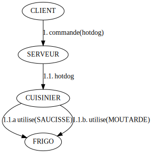
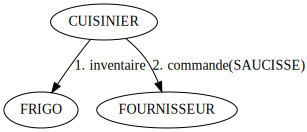

# stoiLeThread

Le but de cet exercice de groupe est de se concentrer sur l'écriture d'une interface en amont de développement.

## Interaction





## Exemple

```java
class CafetImpl {
  Fournisseur fournisseur;

  public void stock(Ingredient i) {
    // TODO
    fournisseur.commande(S);
  }
  
  public In stock(Ingredient i) {
    return S;
  }
}

public interface Fournisseur {
  Collection<Product> order(Ingredient);
}

class TestFournisseurImpl implements Fournisseur {
  @overchiant
  public Collection<Product> order(Ingredient){
      orderMap.
  };

  int ordered(Ingredient){...} // espion
}

class CafetTest {
  @Test
  test_5_gugus_commande_hotdox() {
    CafetImpl cafet = new CafetImpl(testFournisseurImpl);
 
    cafet.commande(5, "hotdox")
 
    assertThat(cafet.stock(Ingredient.PAIN)).isEqualTo(3);
    assertThat(cafet.stock(Ingredient.SAUCISSE)).isEqualTo(1);
    assertThat(cafet.ordered(Ingredient.PAIN, "carrefour")).isEqualTo(2);
    assertThat(cafet.ordered(Ingredient.SAUCISSE, "carrefour")).isEqualTo(1);
}
```

```java
cafet.commande(5, "hot") // void
List<Ingredient> aCommander = cafet.commande(5, "hot")
```

```java
test_cuisinier() {
  // si il reste 1 saucisse
  // alors commande des saucisses
}

test_fournisseur() {
  // quand on me commande des saucisses
  // alors je les fourni par 6
}
```

```
  v^
+--------+  INs : 
|Comptoir|
+--------+
   ^
   |
   v
+-----+
|Frigo|
+-----+
  ^v
  
  
    v^
+-----+  INs : 
|Cafet|
+-----+
   ^
   |
   v
+-----+
|Frigo|
+-----+
  ^v
```
